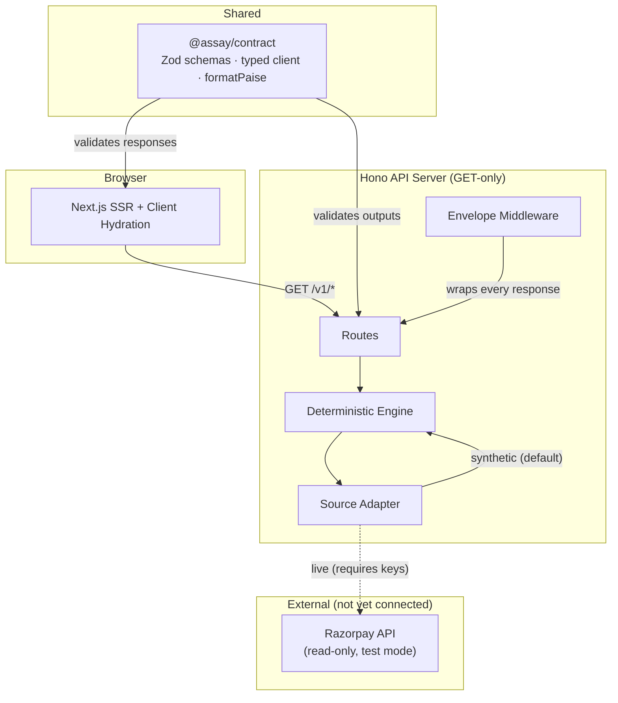
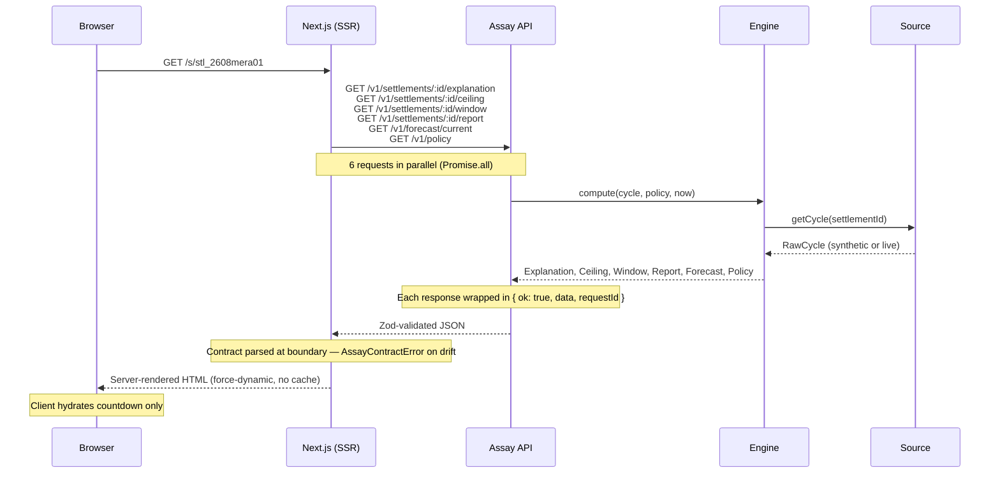

# Assay

**Assay tells you what your settlement is actually made of.**

A payment gateway credits ₹11,28,918 when a merchant expected ₹11,44,000. She knows the difference is fees, refunds, chargebacks and tax — but she has no way to verify that the ₹24,000 gateway fee is correct, because the three UPI rails carrying different statutory network MDR arrive on her report under one word: `UPI`. Assay takes one settlement cycle and one approved fee policy, puts the entire gross-to-net waterfall on a single screen, and cites every line to the rule or the API field that produced it. Every rupee reconciles. A third of it cannot be independently checked. Those are two different statements, and only the first one is being answered today.

> **constructed scenario · every rule real, every volume chosen**
>
> The merchant, her volumes, her instrument mix and her plan are constructed to show scale at a believable Indian SMB. The arithmetic is correct and every rule underneath it is real. Assay is gateway-agnostic, runs on synthetic data, and is never pointed at a named provider's real statement.

---

## Contents

- [The Problem](#the-problem)
- [The Solution](#the-solution)
- [Key Features](#key-features)
- [User Journeys](#user-journeys)
- [Architecture](#architecture)
- [Tech Stack](#tech-stack)
- [Project Structure](#project-structure)
- [Data Flow](#data-flow)
- [API Contract](#api-contract)
- [Configuration & Environment](#configuration--environment)
- [Getting Started](#getting-started)
- [Scripts](#scripts)
- [Testing](#testing)
- [Deployment](#deployment)
- [Design System](#design-system)
- [Engineering Decisions](#engineering-decisions)
- [Accessibility](#accessibility)
- [Limitations](#limitations)
- [Where to Make a Change](#where-to-make-a-change)
- [Contributing](#contributing)

---

## The Problem

An Indian SMB merchant receives a settlement from her payment gateway. The credited amount is less than she expected. The difference is fees, refunds, taxes and chargebacks — but her dashboard reports the gateway fee as a single number spanning five payment rails with three different statutory network MDR rates. Three of those rails are labelled identically as `UPI` on her settlement report.

She cannot verify whether the fee is correct. Not because it is wrong — it may be exactly right — but because the fields she is given do not split it into the pieces the underlying rules require. The three-day window for reporting a discrepancy is ticking.

## The Solution

Assay decomposes a settlement into its constituent lines — gross captured, gateway fee, refunds, tax, chargebacks, failed-payment fees, on-demand settlement fees — each carrying:

- **A citation** tracing the number to its source: an API field read from the rail, a human-approved policy line, a statute, or deterministic arithmetic over other cited lines
- **A reconciliation flag** — does this line add up against the rail's own figures?
- **A verifiability flag** — can the merchant independently check the rule that produced it from the fields she is given?

The finding is quantified: on the worked example, 100% of the ₹71,082 gross-to-net delta reconciles. 33.8% of it (₹24,000) cannot be checked. Three specific missing fields would close the gap exactly, and they do not overlap.

## Outcome

A merchant can see exactly where her money went, which deductions she can verify, which she cannot, and what fields would close the gap — all within the contractual window for reporting a discrepancy. A generated report, ready to copy or download, cites every claim to its source.

---

## Key Features

### Waterfall Trace

A nine-line decomposition of the settlement, from gross captured to net credited. Every line carries a running balance down a vertical axis, a citation chip showing its provenance, and the formula that produced it. The axis shifts from neutral to amber at the point where the merchant's own arithmetic ends and the unexplained gap begins.

### Explainability Ceiling

Two independent axes on the same delta — one asking "does it add up?" (reconciliation) and the other asking "can she check it?" (verifiability). The panel shows a proportional bar for each, names the three fields that would close the verifiability gap, and proves they do not overlap by summing them.

### Three-Day Countdown

A live countdown driven by the server's clock (never the browser's) showing the contractual dispute window. Three states — `open`, `closing` (amber, under 24 hours), and `expired` — with the transition derived from the ticking remainder, not from a static status flag.

### Line Drawer

Clicking any waterfall row opens a detail panel showing: the deterministic formula, its inputs, the full citation with quote and source URL, and — on the unverifiable line — a table of the five payment rails, three of which arrive on the merchant's report as one word.

### Discrepancy Report

A machine-generated markdown report assembled from the reconciled lines (no model writes a word of it). Every claim is cross-linked to a waterfall line and citation. Copy to clipboard or download as `.md`. Assay never sends it — the merchant pastes it into her own email.

### Forecast Strip

The next cycle's projected net, computed by the same deterministic engine run forward. Backtest accuracy is stated honestly: `cycles === 0` renders as "accuracy not yet measured", never as zero error.

### Citation Provenance

Four kinds of source, colour-coded and consistent everywhere:

| Kind | Meaning | Strength |
|------|---------|----------|
| `api_field` | Read verbatim from the rail's response | Strongest — cannot go stale |
| `policy_line` | Model-parsed from a rate card or T&C, human-approved before use | Strong |
| `statute` | A published law or regulation | Strong |
| `derived` | Deterministic arithmetic over other cited lines | Strong |

### Zero-MDR Exposure

The ceiling panel surfaces a separate finding: how much volume moved on rails carrying zero network MDR by statute (UPI from a bank account under PSSA §10A / Income-tax Act §269SU) and still attracted a fee under the merchant's flat plan.

---

## User Journeys

### Investigating a Settlement

```text
Merchant lands on /s/stl_2608mera01
   ↓
Verdict: ₹11,28,918 landed, ₹11,44,000 expected, ₹15,082 unexplained
   ↓
Countdown: 17h 42m left to report (server clock, amber)
   ↓
Waterfall: 9 lines, running balance, citation chips
   ↓
Clicks a line → drawer opens: formula, inputs, citation, source
   ↓
Gateway fee line: "basis not verifiable" — 5 rails, 3 collapsed as "UPI"
   ↓
Ceiling panel: 100% reconciles, 33.8% unverifiable, 3 fields to close it
   ↓
"Prepare discrepancy report" → sheet opens: 6 claims, ₹15,082 disputed
   ↓
Copy or download → paste into her own email
```

### Window Expiry

```text
Countdown crosses zero while the page is open
   ↓
Strip transitions from amber (closing) to red (expired) — no reload
   ↓
Copy reads: "You could have disputed ₹15,082 until 6 Sep 2026, 11:00 IST"
   ↓
Report is still accessible; next cycle date shown if available
```

---

## Architecture



### Subsystem Responsibilities

| Subsystem | Responsibility |
|-----------|---------------|
| `@assay/contract` | Zod schemas defining every type, the API client, and money formatting. Imported by both apps. The single source of truth for the API shape. |
| `apps/api` | Hono server. GET-only by construction — anything else returns 405. Routes, envelope middleware, CORS, deterministic engine, source adapter. |
| `apps/api/src/engine/` | Pure computation: `calculate`, `analyseCeiling`, `buildDisputeWindow`, `buildReport`, `forecast`. No I/O, no clock, no env vars. |
| `apps/api/src/sources/` | Adapter layer: `synthetic` (seeded generator, default) or `live` (Razorpay SDK, requires keys). |
| `apps/api/src/domain/` | Shared internal types between engine streams. Frozen after wave 0 — no downstream stream edits this directory. |
| `apps/web` | Next.js 16 frontend. Server-rendered console page, client hydration for the countdown and overlays. |
| `tools/` | Mock server (reads committed fixture JSON), contract verifier, fixture builder. |

---

## Tech Stack

| Layer | Technology | Role |
|-------|-----------|------|
| Frontend | Next.js 16, React 19 | Server-rendered settlement console, client-side countdown |
| Styling | Tailwind CSS 4, custom CSS (`assay.css`) | Design system: dark theme, custom tokens |
| UI Components | Base UI (React), Lucide icons, shadcn | Primitives, icon set |
| 3D | Three.js | Landing page visual (scroll-driven object) |
| API | Hono, @hono/node-server | GET-only HTTP server with middleware |
| Contract | Zod | Shared schema validation at every boundary |
| Language | TypeScript (strict, `noUncheckedIndexedAccess`) | End-to-end type safety |
| Runtime | Node.js ≥ 20 | Server runtime |
| Package Manager | pnpm 10.28 (workspaces) | Monorepo dependency management |
| Build | tsx (API), Next.js (web) | No separate compile step for the API |
| Deployment | Render (Blueprint in `render.yaml`) | Two web services: `assay-api` + `assay-web`, Singapore region |
| CI | GitHub Actions | Typecheck, tests, fixture sync, contract conformance |

---

## Project Structure

```text
assay/
├── apps/
│   ├── api/                        # Hono API server
│   │   ├── src/
│   │   │   ├── server.ts           # Assembly: CORS → envelope → method guard → routes
│   │   │   ├── config.ts           # All env reads happen here, once
│   │   │   ├── envelope.ts         # { ok, data, requestId } / { ok, error, requestId }
│   │   │   ├── engine-computed.ts   # Wires engine functions to the source adapter
│   │   │   ├── store.ts            # In-process memoisation
│   │   │   ├── engine/             # Pure computation — no I/O, no clock
│   │   │   │   ├── calculate.ts    # The waterfall: gross → lines → net
│   │   │   │   ├── ceiling.ts      # Explainability ceiling analysis
│   │   │   │   ├── forecast.ts     # Same engine, run forward
│   │   │   │   ├── report.ts       # Discrepancy report generation
│   │   │   │   ├── window.ts       # Three-day dispute window
│   │   │   │   ├── policy-apply.ts # Applies fee policy to a cycle
│   │   │   │   ├── instrument-mix.ts
│   │   │   │   ├── to-contract.ts  # Internal → contract shape
│   │   │   │   ├── ports.ts        # Engine interfaces
│   │   │   │   └── golden.test.ts  # Deep-equality against frozen fixture
│   │   │   ├── routes/             # One file per endpoint group
│   │   │   ├── sources/            # synthetic (seeded generator) | live (Razorpay)
│   │   │   └── domain/             # Frozen internal types (the "seam")
│   │   └── test/                   # 6 test files, 97+ engine assertions
│   │
│   └── web/                        # Next.js 16 frontend
│       ├── app/
│       │   ├── layout.tsx          # IBM Plex Sans + IBM Plex Mono
│       │   ├── page.tsx            # Landing page (scroll-driven investigation)
│       │   ├── globals.css         # Tailwind + shadcn tokens
│       │   ├── assay.css           # Console design system (~49k)
│       │   ├── landing.css         # Landing page styles (~49k)
│       │   └── s/[settlementId]/
│       │       └── page.tsx        # Console: server-fetched, force-dynamic
│       ├── components/
│       │   ├── console.tsx         # Assembles the five zones + two overlays
│       │   ├── verdict.tsx         # Landed / expected / unexplained
│       │   ├── waterfall.tsx       # The 9-line trace
│       │   ├── ceiling-panel.tsx   # Reconciliation + verifiability bars
│       │   ├── window-strip.tsx    # Countdown (server clock)
│       │   ├── forecast-strip.tsx  # Next cycle projection
│       │   ├── line-drawer.tsx     # Detail overlay per line
│       │   ├── report-sheet.tsx    # Copy/download discrepancy report
│       │   ├── site-header.tsx     # Brand, cycle selector, "constructed" badge
│       │   ├── atoms.tsx           # Chip, Eyebrow, Digits, Icon
│       │   ├── skeleton.tsx        # Loading state
│       │   ├── empty-state.tsx     # Empty settlement list
│       │   ├── unreachable.tsx     # API error state
│       │   ├── demo-switcher.tsx   # Window state override for recordings
│       │   └── landing/            # 11 files: scroll-driven landing page
│       └── lib/
│           ├── api.ts              # createClient + loadConsole
│           ├── format.ts           # Deduction, signed, money, countdown, IST
│           └── use-server-clock.ts # Server-time offset hook
│
├── packages/
│   └── contract/                   # @assay/contract — shared Zod schemas
│       └── src/
│           ├── contract.ts         # 447 lines: every type, enum, endpoint
│           ├── client.ts           # Typed fetch client with contract validation
│           ├── money.ts            # formatPaise, bps, rupees, share
│           ├── fixtures.ts         # Canonical fixture data
│           ├── index.ts            # Re-exports
│           └── reconcile.test.ts   # Contract-level tests
│
├── tools/
│   ├── mock-server.mjs            # Serves fixture JSON on localhost:4317
│   ├── verify-contract.ts         # Hits every endpoint, validates against schemas
│   ├── build-fixtures.ts          # Regenerates fixture JSON from engine
│   ├── with-mock.mjs              # Runs a command with the mock server up
│   ├── fixtures.generated.json    # Committed fixture (CI checks sync)
│   └── invariants/                # Structural invariant checks (5 files)
│
├── scripts/
│   └── spike-razorpay.mts         # Razorpay API shape discovery (no keys yet)
│
├── docs/
│   ├── SUBMISSION.md              # What Assay does, what broke, what would come next
│   ├── BUILD_LOG.md               # Engineering log: decisions, failures, fixes
│   ├── assay_context.md           # Full project context
│   ├── razorpay-shapes.json       # Field lists from published docs (observed: false)
│   ├── adr/                       # Architecture Decision Records (3)
│   └── log/                       # Development log
│
├── .github/workflows/ci.yml      # Typecheck, tests, fixture sync, contract conformance
├── render.yaml                    # Render Blueprint: 2 services, Singapore
├── pnpm-workspace.yaml            # Monorepo: apps/* + packages/*
├── .env.example                   # Every env var, annotated
├── .nvmrc                         # Node 22
└── tsconfig.json                  # Strict, noUncheckedIndexedAccess
```

---

## Data Flow

### Settlement Explanation Request



### Money Flow (The Waterfall)

```text
₹12,00,000     Gross captured (960 payments)
     ↓
− ₹24,000      Gateway fee (5 rails, 3 collapsed as "UPI")
− ₹20,500      Refund principal (41 refunds)
−  ₹4,320      GST on fees (18% of gateway fee)
−  ₹3,300      Failed payment fee (1,100 × ₹3)
−  ₹8,000      Chargeback principal (2 disputes)
−  ₹1,000      Chargeback fee (2 × ₹500)
−  ₹9,962      On-demand settlement fee (read from API)
     ↓
₹11,28,918     Net credited (reconciliation delta: ₹0)
```

---

## API Contract

All endpoints are `GET`-only. Assay is read-only by construction — it never moves money. Money is integer paise, signed. Time is epoch milliseconds. Every response is wrapped in `{ ok: true, data, requestId }` or `{ ok: false, error: { code, message, field }, requestId }`.

| Endpoint | Path | Purpose |
|----------|------|---------|
| `health` | `GET /v1/health` | Contract version, source (`mock` or `live`), server time |
| `listSettlements` | `GET /v1/settlements` | Paged settlement summaries |
| `getSettlement` | `GET /v1/settlements/:id` | Single settlement summary |
| `getExplanation` | `GET /v1/settlements/:id/explanation` | The waterfall — the product |
| `getCeiling` | `GET /v1/settlements/:id/ceiling` | Explainability ceiling (the gap panel) |
| `getWindow` | `GET /v1/settlements/:id/window` | Three-day dispute window with server clock |
| `getReport` | `GET /v1/settlements/:id/report` | Generated discrepancy report |
| `getForecast` | `GET /v1/forecast/current` | Next-cycle projection |
| `getPolicy` | `GET /v1/policy` | Every rule, with citation and approver |

The contract is defined in `packages/contract/src/contract.ts` as Zod schemas imported by both apps. `tools/verify-contract.ts` iterates the `endpoints` object, so an endpoint not listed there is not part of the contract.

### Error Codes

`not_found` · `bad_request` · `unauthorized` · `policy_not_approved` · `reconciliation_failed` · `internal`

`reconciliation_failed` is the critical one: if the waterfall does not sum to the credited amount, the API refuses to answer rather than rendering a number that does not add up.

---

## Configuration & Environment

Copy `.env.example` to `.env.local`:

```bash
cp .env.example .env.local
```

| Variable | Required | Default | Purpose |
|----------|----------|---------|---------|
| `ASSAY_SOURCE` | No | `synthetic` | `synthetic` (seeded generator) or `live` (Razorpay — requires keys) |
| `ASSAY_SEED` | No | `4217` | Seed for the synthetic generator. Deterministic: same seed, same settlement. |
| `ALLOWED_ORIGIN` | No | `http://localhost:3000` (dev) | Browser origin the API answers. `localhost:3000` is added automatically outside production. |
| `PORT` | No | `4318` | API port. Render sets this itself. |
| `RAZORPAY_KEY_ID` | Only if `ASSAY_SOURCE=live` | — | Read-only test-mode key. Assay issues no write calls. |
| `RAZORPAY_KEY_SECRET` | Only if `ASSAY_SOURCE=live` | — | Paired with `RAZORPAY_KEY_ID`. Never commit. |
| `OPS_TOKEN` | No | — | Guards ops endpoints. Render generates this. |
| `ANTHROPIC_API_KEY` | No | — | For the policy parser (not yet built). Not required to run the API. |
| `NEXT_PUBLIC_ASSAY_API` | Yes (web) | `http://localhost:4318` | API base URL. Inlined at build time by Next — changing it requires a rebuild. |

**Important:** `ASSAY_SOURCE=live` without Razorpay keys is a startup failure, not a silent fallback. The API refuses to start rather than serving synthetic data under a live banner.

---

## Getting Started

### Prerequisites

- Node.js ≥ 20 (`.nvmrc` specifies 22)
- pnpm 10.28+ (`corepack enable && corepack prepare pnpm@10.28.0 --activate`)

### Quick Start

```bash
git clone <repository-url>
cd assay
pnpm install
```

**Terminal 1 — API + Web (parallel):**

```bash
pnpm dev
```

This runs both `apps/api` (port 4318) and `apps/web` (port 3000) in parallel.

**Open:** `http://localhost:3000/s/stl_2608mera01`

### Using the Mock Server (no API needed)

```bash
pnpm mock                       # serves fixture on http://localhost:4317
```

Then set `NEXT_PUBLIC_ASSAY_API=http://localhost:4317` in `apps/web/.env.local` and run `pnpm --filter @assay/web dev`.

### Mock Server States

The mock server supports environment variable overrides to exercise every UI state:

```bash
ASSAY_MOCK_WINDOW=open     pnpm mock   # ~66h left
ASSAY_MOCK_WINDOW=closing  pnpm mock   # ~18h left (amber) — default
ASSAY_MOCK_WINDOW=expired  pnpm mock   # window lapsed
ASSAY_MOCK_WINDOW=fixed    pnpm mock   # frozen clock for screenshots

ASSAY_MOCK_LATENCY_MS=1200 pnpm mock   # loading states
ASSAY_MOCK_FAIL=getCeiling pnpm mock   # error state for one panel
ASSAY_MOCK_EMPTY=1         pnpm mock   # empty settlement list
```

---

## Scripts

| Command | Purpose |
|---------|---------|
| `pnpm dev` | Run API + web in parallel (development) |
| `pnpm mock` | Start the mock server (reads committed fixture JSON) |
| `pnpm test` | Contract tests + API engine tests |
| `pnpm test:golden` | Deep-equality against frozen explanation fixture |
| `pnpm typecheck` | `tsc --pretty false` across the monorepo |
| `pnpm build` | Production build of the web app |
| `pnpm verify` | Hit every endpoint on a running API, validate against contract |
| `pnpm verify:mock` | Same, but starts the mock server first |
| `pnpm fixtures:build` | Regenerate `tools/fixtures.generated.json` from the engine |
| `pnpm fixtures:check` | Regenerate + `git diff --exit-code` (CI uses this) |
| `pnpm spike:razorpay` | Razorpay API shape discovery (requires keys) |
| `pnpm --filter @assay/web lint` | ESLint on the web app |

---

## Testing

### What exists

| Suite | Command | Assertions |
|-------|---------|------------|
| Contract reconciliation | `pnpm --filter @assay/contract test` | Validates money arithmetic, fixture consistency |
| Engine tests | `tsx --test apps/api/test/*.test.ts` | 97+ assertions across calculator, ceiling, cross-cycle, generator, invariants, window/report/forecast |
| Golden test | `pnpm test:golden` | `calculate(MEERA_CYCLE, POLICY)` deep-equals the frozen fixture |
| Contract conformance | `pnpm verify:mock` | Every endpoint responds and validates against Zod schemas (14/14) |
| Structural invariants | Run via `pnpm verify` | Waterfall sums, ceiling partitions, cross-cycle consistency, report claims |
| Fixture sync | `pnpm fixtures:check` | Generated JSON matches committed version (CI enforced) |
| Typecheck | `pnpm typecheck` | Strict TypeScript across the monorepo |

### What CI enforces

```yaml
# .github/workflows/ci.yml
- pnpm test            # reconciliation tests
- pnpm typecheck       # type safety
- pnpm fixtures:check  # generated fixture cannot drift
- pnpm verify:mock     # contract conformance over HTTP
```

### Key invariants the tests enforce

1. Signed lines (excluding `net_credited`) sum exactly to `netCredited`
2. Reconciliation delta is 0
3. `merchantExpected − netCredited === unexplainedGap`
4. Instrument mix gross sums to `grossCaptured`; instrument fees sum to the gateway fee line
5. Every line has a citation with a non-empty `sourceId`
6. `basisVerifiable: false` requires a non-null `unverifiableReason`
7. Ceiling buckets sum to `totalDelta` on both axes; shares sum to 1.0000
8. `missingFields[].wouldResolve` sums to `basisUnverifiable.amount`
9. Every policy line is `parsedBy: "model"` and `approved: true` with a named approver
10. `Forecast.backtest.cycles === 0` renders as "accuracy not yet measured"

---

## Deployment

### Render (configured but not yet deployed)

`render.yaml` defines a Blueprint with two web services in the Singapore region:

| Service | Runtime | Build | Start | Health Check |
|---------|---------|-------|-------|-------------|
| `assay-api` | Node 22 | `pnpm install --frozen-lockfile` | `pnpm --filter @assay/api start` | `/v1/health` |
| `assay-web` | Node 22 | `pnpm install --frozen-lockfile && pnpm --filter @assay/web build` | `pnpm --filter @assay/web start` | `/` |

Environment variables are wired between services: `ALLOWED_ORIGIN` on the API reads from the web service's host, and `NEXT_PUBLIC_ASSAY_API` on the web reads from the API service's host. `OPS_TOKEN` is auto-generated.

> **Status:** The Blueprint is committed but has not been created on Render. There is no live URL.

---

## Design System

Dark theme, no shadows, no gradients. IBM Plex Sans for prose, IBM Plex Mono for every number, id, timestamp and citation.

```
bg       #0c0e11     surface  #14171c     raised   #1b1f26
border   #262b33     text     #e6e9ee     muted    #8b94a3     dim   #5d6675
positive #3fb950     warning  #d29922     negative #f85149     link  #58a6ff
```

| Token | Use |
|-------|-----|
| `warning` | Closing window countdown, `basisVerifiable: false` rows |
| `negative` | Expired window, failed reconciliation only |
| `positive` | Used sparingly — a reconciled waterfall is the baseline, not a success |
| Radii | 6px controls, 8px cards |
| Borders | 1px, `#262b33` |

### Typography Rule

> Every number is mono, every sentence is sans.

This single rule holds the design together. Money, ids, timestamps and citations are set in IBM Plex Mono with tabular figures so columns align. Everything else is IBM Plex Sans. The landing page adds Schibsted Grotesk for sentences and keeps Plex Mono for figures.

---

## Engineering Decisions

### Read-Only by Construction

Every endpoint is `GET`. The method guard in `server.ts` returns 405 for anything else. The Razorpay SDK is configured with `READ_ONLY`. This is not a policy — it is structural: Assay never moves money, and the code cannot be made to do so without removing the guard.

**Trade-off:** No write operations means no annotation, no saved views, no user accounts. The settlement is computed per request and exists only while the page is open.

### No Database

ADR-0001 documents this. Every explanation, ceiling, report and forecast is a pure function of a cycle and a policy. There is nothing to persist that is not derivable. Memoisation is in-process only.

**Trade-off:** A merchant cannot return to last month's explanation, annotate a line, or share a stable URL that survives a redeploy with a different seed.

### Contract as Zod Schema

The contract (`packages/contract/src/contract.ts`) is a set of Zod schemas imported by both apps. Responses are parsed at the boundary before any component sees them. A drifting API throws `AssayContractError` loudly rather than rendering wrong money silently.

**Trade-off:** An additional abstraction layer between the API and the UI. Worth it: money that renders wrong is the one failure this product cannot afford.

### Reconciliation Refuses to Serve

If the waterfall does not sum to the credited amount, the API returns `409 reconciliation_failed` with no payload. A merchant who disputes on the strength of a waterfall that does not close has spent her three-day window on a number the system could not stand behind.

### Server Clock, Never Browser Clock

`DisputeWindow.serverNow` is computed at request time. The client measures the offset once and ticks locally. A laptop whose clock is hours out would otherwise quietly tell a merchant she has time when she does not.

### Reconciling and Verifying are Separate Axes

ADR-0002. Two independent booleans on every line: `amountReconciled` (does the number add up?) and `basisVerifiable` (can she check the rule?). Two independent buckets in the ceiling. Collapsing them would lose the finding.

### Model-Parsed Policy, Human-Approved

ADR-0003. Policy lines are `parsedBy: "model"` and `approved: true` with a named approver and timestamp, or they may not be used to compute a rupee. The human approval is a hard precondition, not a formality.

---

## Accessibility

The following accessibility patterns are implemented in the codebase:

- **Skip links** on both the landing page and the console (`<a class="skip" href="#main">`)
- **Semantic HTML**: `<main>`, `<section>`, `<header>`, `<aside>`, `<nav>`, `<details>`
- **ARIA roles**: `role="dialog"` + `aria-modal="true"` on the line drawer and report sheet; `role="listbox"` on the cycle selector
- **Focus management**: Drawer and sheet trap focus, return it to the trigger on close, and close on Escape
- **`aria-label`** on every section and interactive element; waterfall rows have full computed `aria-label` strings
- **`aria-live="polite"`** on the toast notification
- **Keyboard navigation**: Tab trapping in overlays, Escape to close menus/drawers/sheets
- **Tabular mono figures**: `font-variant-numeric: tabular-nums` so columns align for screen readers that announce character positions

---

## Limitations

- **Constructed scenario only.** Meera's volumes, instrument mix and plan are chosen. Every rule is real; the data is not. The UI says so prominently.
- **No live deployment.** `render.yaml` is committed but the Blueprint has not been created. There is no URL.
- **No authentication.** `TOKEN` is threaded through the verifier and the contract has an `unauthorized` error code, but no route reads the header today.
- **No persistence.** Everything is computed per request and memoised in process. Settlements cannot be saved, annotated, or revisited.
- **No real Razorpay data.** The Razorpay spike made zero API calls — there are no test keys. `docs/razorpay-shapes.json` is marked `observed: false` throughout.
- **Policy parser not built.** `/ops/policy/parse` (the call that turns a rate card into an approved policy) is not implemented. The Anthropic SDK is not installed.
- **Open cycles not generated.** Every synthetic cycle is sealed, so the forecast always falls back to the most recently settled cycle.
- **Web app builds with webpack only.** Turbopack cannot resolve `@assay/contract`'s `.js` → `.ts` re-exports. Pinned to `next build --webpack`.

---

## Where to Make a Change

| I want to… | Start here |
|-------------|-----------|
| Change the waterfall UI | `apps/web/components/waterfall.tsx` |
| Change the ceiling panel | `apps/web/components/ceiling-panel.tsx` |
| Change the countdown logic | `apps/web/components/window-strip.tsx` + `lib/use-server-clock.ts` |
| Change the report generation | `apps/api/src/engine/report.ts` |
| Change how a fee is calculated | `apps/api/src/engine/calculate.ts` + `engine/policy-apply.ts` |
| Change the ceiling analysis | `apps/api/src/engine/ceiling.ts` |
| Add an API endpoint | `packages/contract/src/contract.ts` (schema + endpoints object) → `apps/api/src/routes/` |
| Change the API envelope | `apps/api/src/envelope.ts` |
| Change environment configuration | `apps/api/src/config.ts` (API) or `apps/web/lib/api.ts` (web) |
| Add a source adapter | `apps/api/src/sources/` |
| Change the design tokens | `apps/web/app/assay.css` (console) or `apps/web/app/landing.css` (landing) |
| Change money formatting | `packages/contract/src/money.ts` |
| Add or modify a test | `apps/api/test/` (engine) or `packages/contract/src/` (contract) |
| Add an invariant check | `tools/invariants/` |
| Change the mock server | `tools/mock-server.mjs` |
| Update frozen domain types | **Stop and escalate.** See `apps/api/src/domain/README.md`. |

---

## Contributing

### Contract Changes

The contract is frozen at v0.1.0. Any change after the freeze:

1. Announce in chat — both people, before the edit
2. Bump `CONTRACT_VERSION` in `packages/contract/src/contract.ts`
3. `pnpm fixtures:build` and commit the regenerated JSON
4. `pnpm test && pnpm verify:mock` must pass before pushing

### Domain Changes

`apps/api/src/domain/` is the seam between engine streams. Additive optional fields are allowed with announcement. Anything else — a rename, a narrowing, a required field — requires escalation. See `apps/api/src/domain/README.md`.

### Before Pushing

```bash
pnpm typecheck          # types
pnpm test               # contract + engine tests
pnpm fixtures:check     # fixture sync
pnpm verify:mock        # contract conformance over HTTP
```

---

## Troubleshooting

| Problem | Likely Cause | Resolution |
|---------|-------------|------------|
| API refuses to start with `SourceConfigError` | `ASSAY_SOURCE=live` without Razorpay keys | Set keys in `.env.local` or use `ASSAY_SOURCE=synthetic` |
| Web app shows `AssayContractError` | API response does not match contract schemas | Check that API and web are on the same contract version |
| `@assay/contract` resolves to empty module | Turbopack cannot resolve `.js` → `.ts` re-exports | Use `next dev --webpack` / `next build --webpack` (already configured) |
| Countdown disagrees with expectations | Browser clock drift | The countdown uses `serverNow`, not `Date.now()` — check the API's response |
| `pnpm fixtures:check` fails in CI | `fixtures.generated.json` out of sync | Run `pnpm fixtures:build` and commit the result |
| Mock server returns 404 | Wrong settlement ID | Use `stl_2608mera01` (the canonical fixture) |
| Build fails on `pnpm install` | Wrong pnpm version | `corepack enable && corepack prepare pnpm@10.28.0 --activate` |

---

## Credits

- [Hono](https://hono.dev/) — lightweight HTTP framework
- [Zod](https://zod.dev/) — schema validation
- [Next.js](https://nextjs.org/) — React framework
- [IBM Plex](https://www.ibm.com/plex/) — typeface (Sans + Mono)
- [Lucide](https://lucide.dev/) — icon set
- [Three.js](https://threejs.org/) — landing page 3D
- [Razorpay](https://razorpay.com/docs/api/) — payment gateway (published API documentation used for field shapes)
